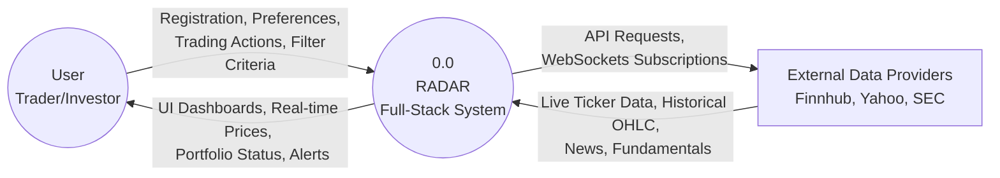
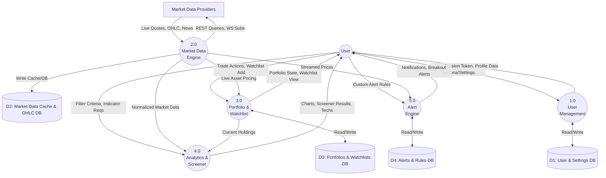
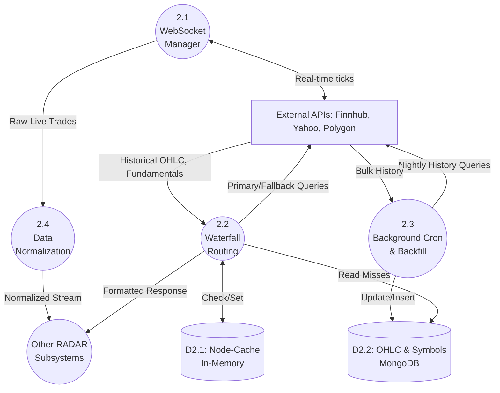
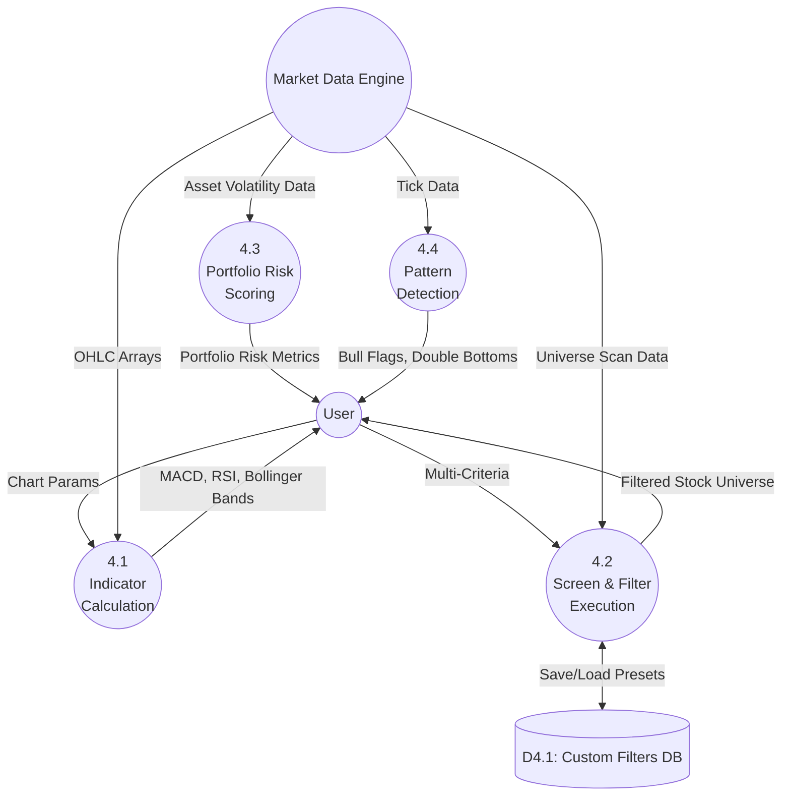
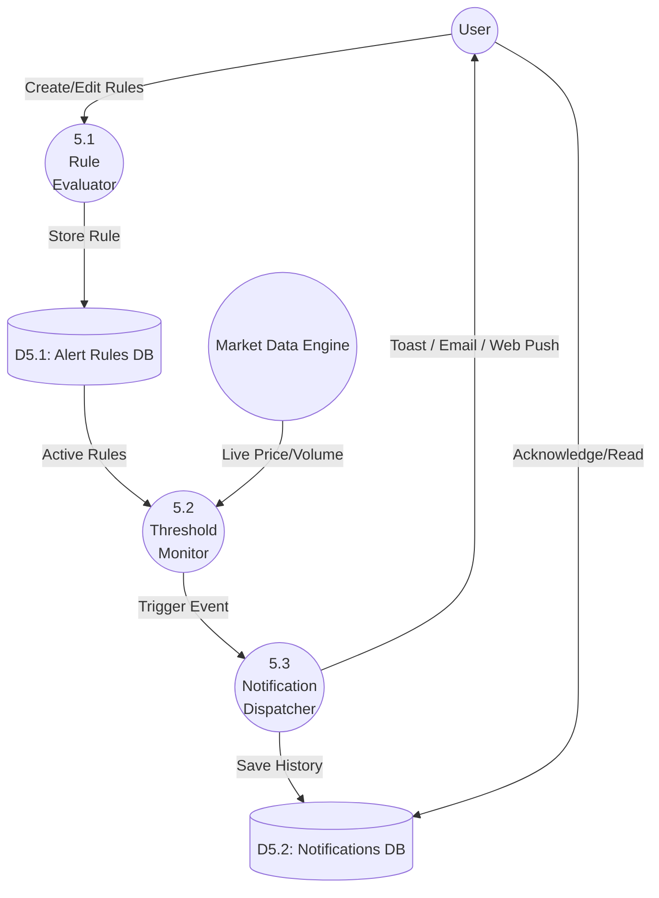

# RADAR System: Data Flow Diagrams (DFDs)

Based on the extensive architectural audit of the RADAR Full-Stack System, these Data Flow Diagrams (DFDs) map out how data moves between external entities, major internal processes, and data stores.

These diagrams use Mermaid.js and follow the Gane & Sarson / Yourdon DFD logical structure.

## 1. Level 0: Context Diagram
The Level 0 DFD illustrates the RADAR platform as a single macro-process interacting with its external environment (Users and Market Data Providers).

---

## 2. Level 1: Core System Processes
This diagram breaks down the RADAR platform into its primary functional subsystems (User Management, Market Data, Portfolio Engine, Analytics, and Alert Engine) and introduces the main data stores.

---

## 3. Level 2: Market Data Processing (Process 2.0 Breakdown)
This diagram zooms into the Market Data Engine, illustrating how RADAR achieves fault tolerance, background caching, and real-time streaming.

---

## 4. Level 2: Analytics & Screener Engine (Process 4.0 Breakdown)
This diagram details the logic behind technical analysis calculations, pattern detection, and the multi-filter screener.

---

## 5. Level 2: Alert & Notification Engine (Process 5.0 Breakdown)
Details how RADAR processes real-time data against user-defined thresholds to emit notifications.

