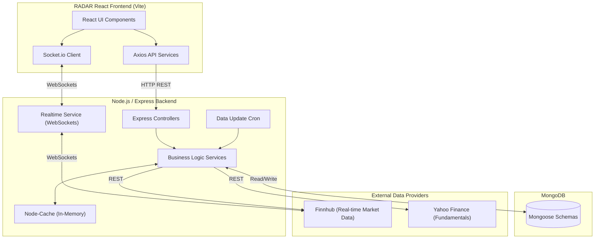
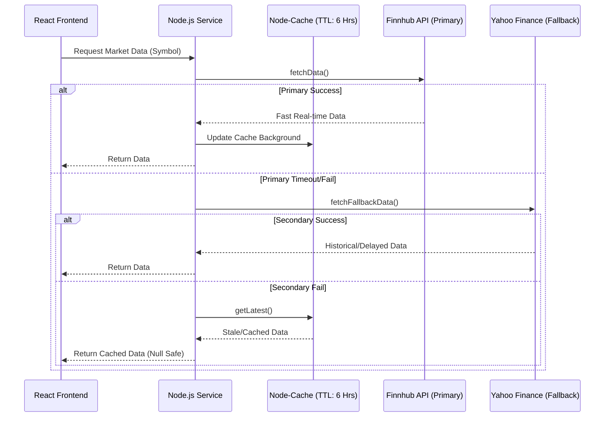
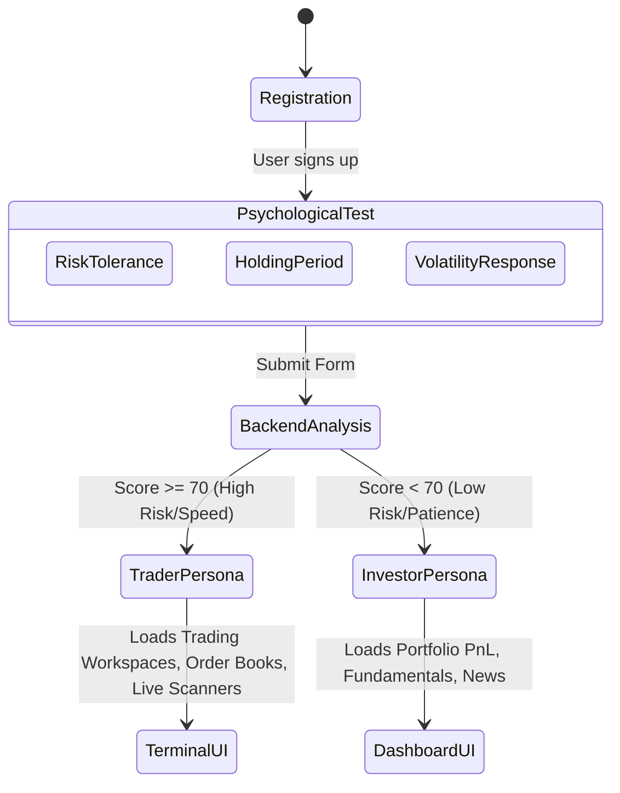

# RADAR System Architecture & Data Flow Diagrams

These diagrams use Mermaid.js. Most Markdown viewers (including GitHub) will render them automatically.

## 1. High-Level System Architecture

## 2. The Fault-Tolerant Waterfall Routing (Data Flow)

## 3. Investor DNA (Dual Persona Onboarding) Flow

